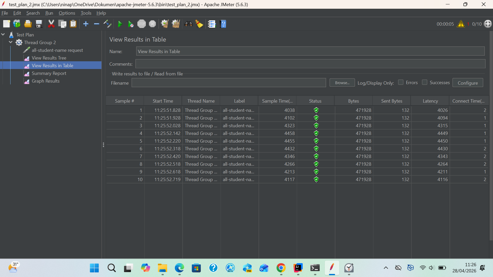
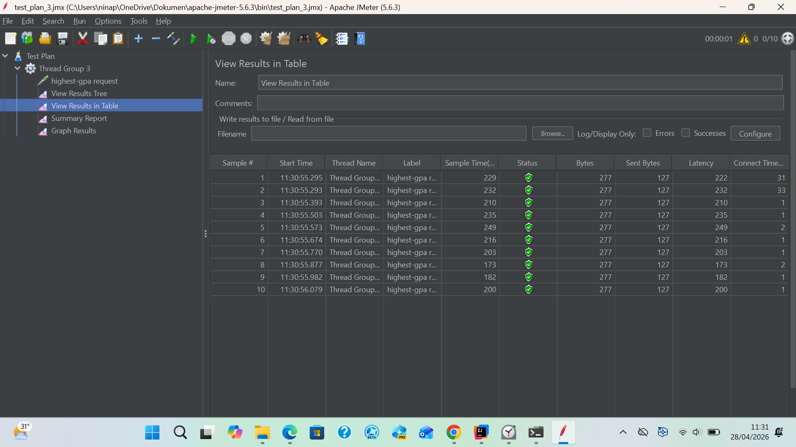
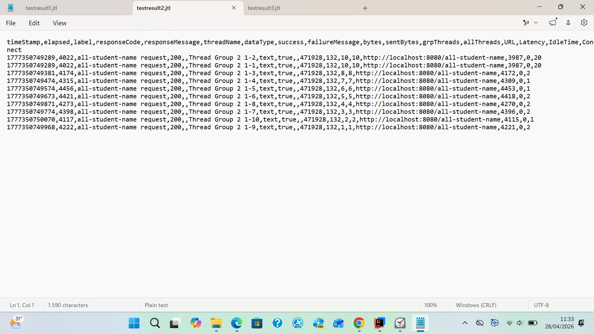
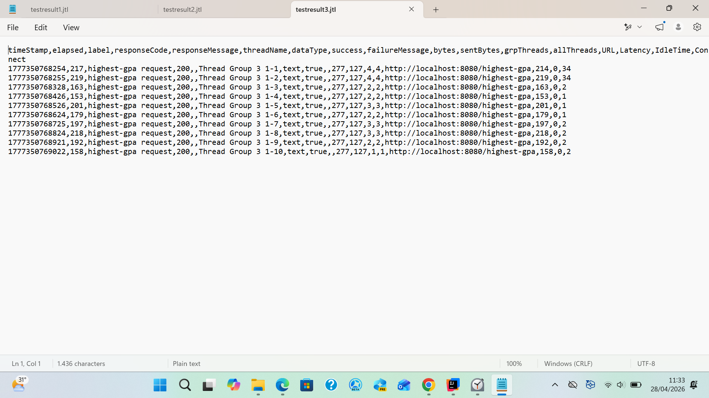
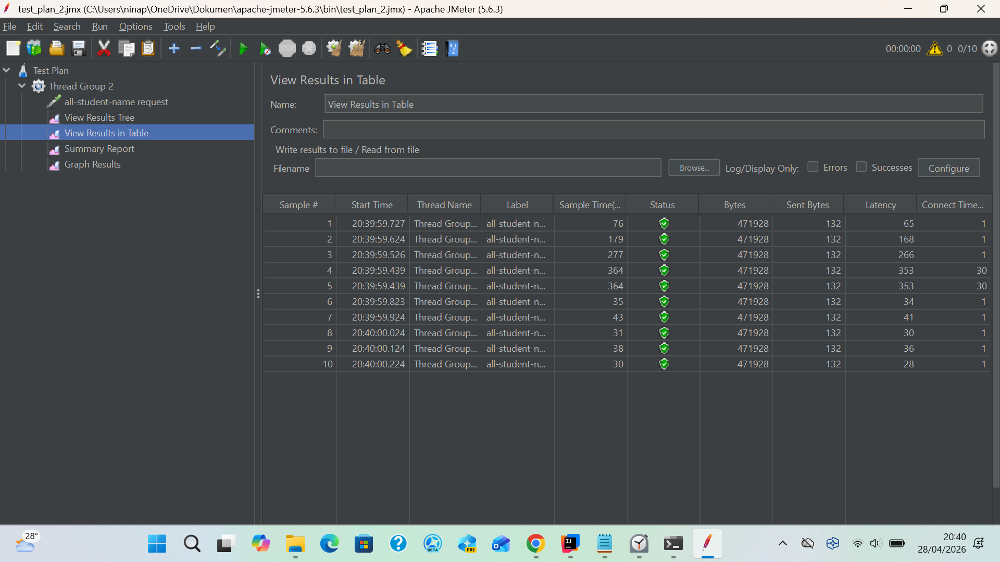
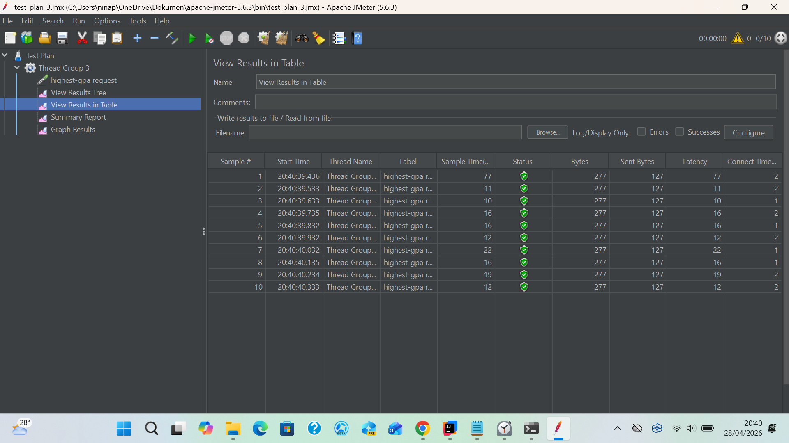

Nama: Nisriina Wakhdah Haris 
NPM: 2406360445 
Kelas: A 

<b>Images</b>

1. Screenshoot from GUI
- test_plan_2.jmx
  

- test_plan_3.jmx
  

2. Screenshoot from CLI
- test_plan_2
  
- test_plan_3
  

3. Screenshot from JMeter after optimization
- test_plan_2
  
  Berdasarkan hasil pengujian menggunakan JMeter, terdapat peningkatan performa yang signifikan setelah dilakukan optimasi pada kode aplikasi.
  Sebelum optimasi, waktu respon endpoint /all-student-name berada di kisaran 4000 ms (±4 detik) untuk setiap request. Hal ini menunjukkan bahwa
  proses masih belum efisien, kemungkinan disebabkan oleh operasi yang tidak optimal seperti penggunaan string concatenation atau pengambilan data yang kurang efisien.
  Setelah dilakukan optimasi, waktu respon menurun drastis menjadi sekitar 30–300 ms. Penurunan ini menunjukkan adanya peningkatan performa yang sangat signifikan,
  jauh melebihi target minimal peningkatan sebesar 20%.
  Optimasi yang dilakukan adalah penggunaan metode yang lebih efisien dalam pengolahan data menggunakan `Stream API` dan `Collectors.joining()` sehingga berhasil
  mengurangi waktu eksekusi dan meningkatkan efisiensi aplikasi secara keseluruhan.

- test_plan_3
  
  Berdasarkan hasil pengujian menggunakan Apache JMeter, terlihat adanya peningkatan performa yang signifikan setelah dilakukan optimasi pada endpoint /highest-gpa.
  Sebelum optimasi, waktu respon berada di kisaran 200–250 ms untuk setiap request. Hal ini menunjukkan bahwa proses masih kurang efisien, kemungkinan karena seluruh
  data mahasiswa diambil terlebih dahulu dan diproses di sisi aplikasi untuk mencari nilai GPA tertinggi. Setelah dilakukan optimasi, waktu respon menurun menjadi sekitar 10–70 ms.
  Penurunan ini menunjukkan peningkatan performa yang sangat signifikan dan jauh melampaui target minimal peningkatan sebesar 20%.
  Optimasi dilakukan dengan memindahkan proses pencarian GPA tertinggi ke database menggunakan query seperti findTopByOrderByGpaDesc(), sehingga tidak perlu lagi memproses seluruh data di sisi aplikasi.
  Hal ini mengurangi beban komputasi dan jumlah data yang diproses, sehingga waktu eksekusi menjadi jauh lebih cepat.

<b>Reflection</b>

1. Dalam konteks optimasi aplikasi, pendekatan menggunakan Apache JMeter dan Intellij IDEA Profiler memiliki tujuan yang berbeda, berikut ini adalah perbedaannya:
- Performance Testing dengan JMeter memiliki fokus utama yaitu mengukur performa aplikasi dari sisi end-to-end (sudut pandang user). Ciri-cirinya adalah:
    - Mengirim banyak request ke endpoint (simulasi user)
    - Mengukur response time (seberapa cepat aplikasi merespons?), throughput, dan error rate
    - Digunakan untuk mengetahui apakah aplikasi cepat atau lambat
    - Menguji  performance pada load testing
- Profilling menggunakan Intellij Profiler berfokus pada analisis penyebab aplikasi menjadi lambat dari dalam (internal code). Ciri-cirinya adalah:
    - Melihat eksekusi method secara detail
    - Menampilkan CPU usage, method paling lambat, memory allocation, alur pemanggilan method (call tree)
    - Digunakan untuk menemukan bottleneck pada code, memory leaks, concurrency issues, dan memahami bagian mana yang perlu dioptimasi (kenapa aplikasi menjadi lambat?)
2. Profilling membantu saya mengidentifikasi dan mengetahui bagian-bagian yang perlu diperbaiki dengan menyediakan informasi dan
   analisis yang real-time mengenai performa program. Melalui proses profiling, saya dapat melihat fungsi mana yang memakan waktu eksekusi paling banyak, serta bagaimana alur pemanggilan
   fungsi (call tree) di dalam aplikasi. Dengan informasi tersebut, saya dapat mengetahui bagian mana yang yang menjadi bottleneck serta membantu saya memahami penggunaan sumber daya CPU dan memori,
   sehingga saya dapat menentukan bagian yang perlu dioptimasi. Oleh karena itu, proses profiling sangat membantu dalam melakukan optimasi karena tidak hanya menunjukkan bagian yang lambat,
   tetapi juga membantu memahami penyebab dari masalah tersebut.
3. Ya, Intellij Profiler sangat efektif dalam membantu saya menganalisis dan mengidentifikasi bottleneck pada kode aplikasi karena dengan fitur profiling yang tersedia,
   saya dapat melihat secara detail bagian kode mana yang paling banyak memakan waktu eksekusi. Selain itu, Intellij Profiler juga menyediakan informasi mengenai penggunaan resource, seperti CPU dan memori
   sehingga saya dapat mengetahui bagian mana yang tidak efisien. Hal ini sangat membantu dalam menentukan langkah optimasi yang tepat, karena didasarkan pada data yang akurat.
4. Tantangan utama yang saya hadapi adalah kesulitan dalam menentukan penyebab utama dari penurunan performance aplikasi meskipun terdapat hasil pengujian yang menunjukkan bahwa aplikasi lambat. Selain itu,
   hasil performance testing kadang tidak konsisten karena dipengaruhi oleh beberapa faktor, seperti spesifikasi hardware, jaringan, dan beban sistem ketika pengujian. Tantangan lain adalah saya kesulitan dalam
   membaca hasil profiling karena terlalu kompleks, sehingga membutuhkan pemahaman lebih dalam agar dapat diinterpretasikan dengan benar.
   Untuk mengatasi kesulitan tersebut, saya melakukan pengujian secara berulang dalam kondisi yang sama agar mendapatkan hasil yang konsisten. Selain itu, saya fokus melakukan optimasi pada bagian yang paling memengaruhi
   performance aplikasi (bottleneck) sehingga perbaikan yang dilakukan lebih efektif.
5. Manfaat utama yang saya peroleh ketikan menggunakan Intellij IDEA Profiler adalah saya dapat mengetahui bagian kode yang menjadi bottleneck melalui hasil analisis performa aplikasi yang tersedia. Selain itu,
   Intellij Profiler membantu saya memahami alur eksekusi program melalui call tree dan informasi ini berguna untuk menemukan pola yang tidak efisien, seperti pemanggilan metode yang berulang atau operasi yang tidak diperlukan atau
   operasi yang dapat disederhanakan. Manfaat lainnya adlaah saya dapat memantau penggunaan sumber daya, seperti CPU dan memori sehingga saya dapat mengetahui bagian aplikasi yang memakan banyak resource. Dengan begitu, saya dapat
   melakukan optimasi sesuai dengan masalah yang ada
6. Hasil profiling dari Intellij IDEA dan hasil performance testing menggunakan Apache JMeter dapat berbeda atau tidak konsisten karena pada dasarnya kedua alat tersebut memiliki fokus yang berbeda. JMeter digunakan untuk mengukur
   perfoma aplikasi secara end-to-end dari sudut pandang user, sedangkan Intellij Profiler digunakan untuk menganalisis performa dari sisi internal kode. Untuk menangani perbedaan tersebut, saya memastikan bahwa pengujian dilakukan
   dalam kondisi lingkungan yang sama dan stabil, seperti beban sistem, koneksi jaringan, dan data yang digunakan, agar hasil lebih konsisten dan melakukan pengujian secara berulang. Lalu, menghubungkan hasil pengujian eksternal dengan
   analisis internal di mana saya menggunakan hasil dari JMeter untuk mengidentifikasi endpoint yang bermasalah, kemudian menggunakan Intellij Profiler untuk menganalisis bagian kode yang menjadi penyebab bottleneck pada endpoint tersebut.
7. Berikut ini adalah strategi yang saya lakukan untuk mengoptimalkan kode, yaitu:
- Mengoptimalkan akses database dengan mengurangi jumlah query yang tidak diperlukan sehingga dapat mengatasi masalah N+1 query menggunakan teknik JOIN FETCH. Dengan cara ini, data yang sebelumnya diambil secara berulang dapat diambil
  dalam satu query yang lebih efisien.
- Memindahkan proses komputasi ke database, seperti menggunakan query langsung untuk mengambil data nilai maksimum pada method `findStudentWithHighestGpa()`, sehingga tidak perlu memproses seluruh data di sisi aplikasi.
- Mengoptimalkan kode di sisi aplikasi dengan mengganti penggunaan string concantenation dengan `Stream API` dan `Collectors.joining()` sehingga dapat mengurangi kompleksitas waktu dan penggunaan memori menjadi lebih efisien

Untuk memastikan bahwa perubahan yang ada tidak memengaruhi fungsionalitas aplikasi, saya melakukan pengujian ulang terhadap endpoint yang sama menggunakan JMeter untuk memastikan hasil yang diberikan tetap benar dan performanya meningkat.
Selain itu, saya juga membandingkan output sebelum dan sesudah optimasi untuk memastikan tidak ada perubahan pada output yang dihasilkan.

